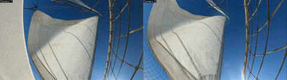

# Esteban Foucher

📧 [estefoucher@gmail.com](mailto:estefoucher@gmail.com)  
📱 +33 6 43 82 27 00

Engineer, physicist – École Normale Supérieure Ulm (class of 2020)

Engineer and physicist trained at École Normale Supérieure Ulm, I work at the intersection of simulation, data, and applied physics. I am currently a thermo-hydraulic simulation engineer at Jimmy Energy, where I contribute to reactor conception. In parallel, I develop an embedded computer-vision system for aerodynamic measurements.

---

## Professional Experience

### 2025 — Thermo‑hydraulic Simulation Engineer, Jimmy Energy

Currently:

- Thermo‑hydraulic simulations (computational fluid dynamics)

Internship:

- Support for reactor design engineering and safety
- Exploratory simulations of chemical kinetics under irradiation

My experience at Jimmy includes an initial internship in 2023–2024, followed by joining the simulations team again in 2025.

---

### 2024 — Data & Performance Engineer, Orient Express Racing Team

- Data engineering & analysis for performance of the AC40 and AC75 racing yachts  
- Data science: development of a post‑processing wind‑reconstruction tool and an optimizer for calibration  
- Collaboration with the mechatronics team for debugging and performance follow‑up

My time at OERT covers in particular the phase of commissioning of the AC75 and participation in the 37th America’s Cup.

---

### 2023 — M2 Research Internship, Nano‑optics

Laboratory of Physics, École Normale Supérieure – Nano‑optics group

**Topic:** Ultra‑broadband photodetection of the two‑dimensional semi‑metal *PtSe₂*.

- Conception of the ultrabroadband micro‑photodetection experiment  
- Fabrication of PtSe₂ field‑effect transistors

- [Download internship report (PDF)](assets/reports/report_2023.pdf)

---

### 2022 — M1 Research Internship, Condensed Matter

Theory & Simulation of Condensed Matter Group – King’s College London

**Topic:** Fully bold formalism at strong coupling regime for the (0 + 0)‑dimensional Hubbard model (theoretical study of a strongly interacting electron system).

- [Download internship report (PDF)](assets/reports/report_2022.pdf)

---

### 2021 — L3 Research Internship, Nanofluidics

Laboratory of Physics, ENS – Nanofluidics group

**Topic:** Measurement of fluid flows at the nanoscale using confocal fluorescence microscopy.

- [Download internship report (PDF)](assets/reports/report_2021.pdf)

---

## Education

### 2020–2024 — École Normale Supérieure, Paris

- **Master ICFP**: Fundamental Physics (quantum physics major)  
- **Bachelor’s degree**: Fundamental Physics

**Main subjects:**

- **Physics:** quantum physics, statistical physics, solid‑state physics, special relativity, quantum field theory, general relativity, fluid mechanics  
- **Computer science / numerical methods:** numerical methods for partial differential equations, machine learning  
- **Mathematics:** statistics, probability, optimization, algebra, analysis

---

## Projects

### SailCV – Embedded computer‑vision for aerodynamic measurements

Motivated by my experience in the sailing world, I am developing in my spare time an embedded computer‑vision project dedicated to aerodynamic measurements.

The project is divided into two sub‑projects:

#### SailCV – tell‑tale‑tracker

Design of a tell‑tale tracker to monitor boundary‑layer separation. Creation of a dataset and fine‑tuning of a detector.

#### SailCV – 3D‑reconstruction

This project aims to accurately reconstruct metric point clouds from calibrated stereo views. It is based on two main components:

- the ability of recent AI models dedicated to 3D reconstruction to predict dense point correspondences between two views of the same object;  
- precise calibration of the intrinsic and extrinsic parameters of a dual‑camera system, enabling accurate triangulation.

| Stereo reconstruction | Combined view |
| --- | --- |
|  |  |

---

### Normale Physics Review

Contribution to the creation and writing of the student physics journal [Normale Physics Review](https://normalephysicsreview.netlify.app/).

